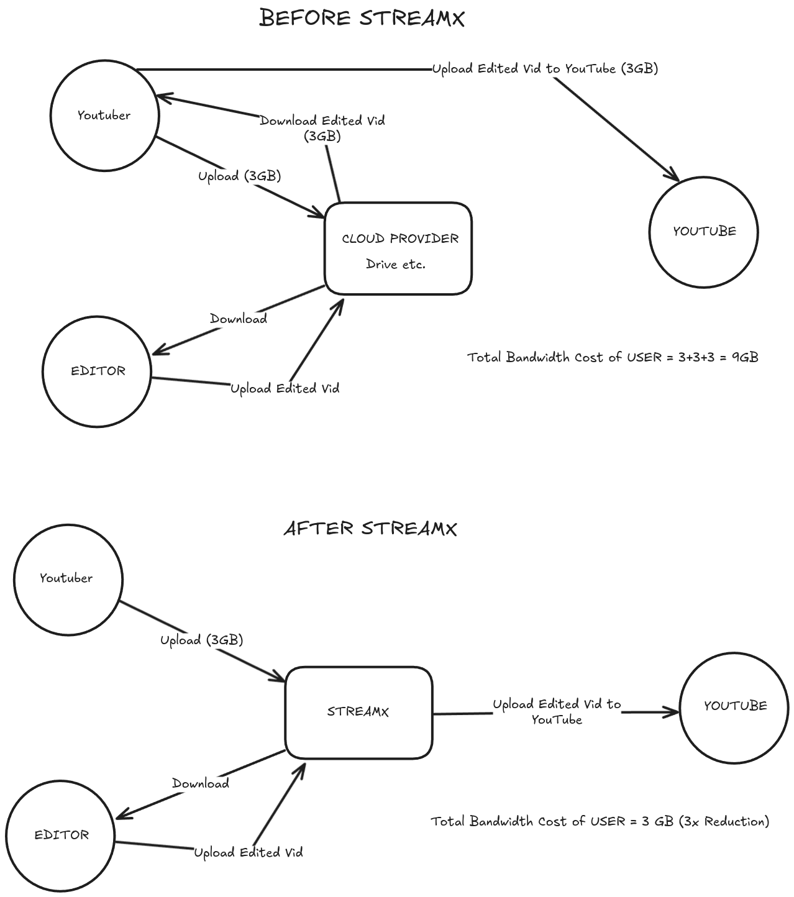

# StreamX

**StreamX** is a revolutionary cloud-based platform that optimizes the workflow between YouTubers and video editors. By providing a centralized solution for video collaboration, **StreamX** significantly reduces bandwidth usage and streamlines the content creation process.

## 💡 Idea



## 🚀 Key Features

- **Efficient Video Management**: Reduce bandwidth usage by up to 66% through smart video handling
- **Seamless Collaboration**: Direct connection between content creators and editors
- **YouTube Integration**: Direct upload capabilities to YouTube
- **Secure File Handling**: Enterprise-grade security for your content
- **Real-time Progress Tracking**: Monitor editing progress and project status
- **Role-based Access Control**: Dedicated interfaces for YouTubers and editors

## 🛠️ Tech Stack

### Frontend

- React.js with Vite
- Tailwind CSS with DaisyUI
- State Management with Redux Toolkit and Recoil
- UI Components with Radix UI and Material UI
- Charts with Recharts and React-Chartjs-2
- Auth0 for authentication
- Animation with Framer Motion
- UI enhancement with React Hot Toast, Swiper, and React Slick

### Backend

- Node.js & Express.js
- MongoDB for database
- Auth0 & JWT for authentication
- Firebase for storage
- Passport for OAuth
- Google APIs for YouTube integration
- Express OAuth 2.0 JWT Bearer

## 📋 Prerequisites

- Node.js (v18 or higher)
- MongoDB
- AWS Account
- YouTube API credentials

## 🔧 Installation

1. Clone the repository

    ```bash
    git clone https://github.com/yourusername/streamx.git
    cd streamx
    ```

2. Install dependencies for both client and server

    ```bash
    # Install client dependencies
    cd client
    npm install

    # Install server dependencies
    cd ../server
    npm install
    ```

3. Configure environment variables

    ```bash
    # In server/.env
    ## MongoDB
    MONGODB_URI=your_mongodb_uri
    MONGO_DB_USER=your_mongodb_user
    MONGO_DB_PASSWORD=your_mongodb_password

    ## Firebase
    FIREBASE_API_KEY=your_firebase_api_key
    FIREBASE_AUTH_DOMAIN=your_firebase_auth_domain
    FIREBASE_PROJECT_ID=your_firebase_project_id
    FIREBASE_STORAGE_BUCKET=your_firebase_storage_bucket
    FIREBASE_MESSAGING_SENDER_ID=your_firebase_messaging_sender_id
    FIREBASE_APP_ID=your_firebase_app_id
    FIREBASE_MEASUREMENT_ID=your_firebase_measurement_id

    ## Port
    PORT=5000

    ## Client
    CLIENT_ORIGIN_URL=http://localhost:5173

    ## AUTH0
    AUTH0_AUDIENCE=your_auth0_audience
    AUTH0_DOMAIN=your_auth0_domain
    AUTH0_M2M_CLIENT_ID=your_auth0_m2m_client_id
    AUTH0_M2M_CLIENT_SECRET=your_auth0_m2m_client_secret
    AUTH0_TOKEN_EXPIRATION=your_auth0_token_expiration
    AUTH0_ACCESS_TOKEN=your_auth0_access_token

    ## GOOGLE
    GOOGLE_CLIENT_SECRET_PATH=your_google_client_secret_path
    ```

    ```bash
    # In client/.env
    VITE_API_URL=http://localhost:5173
    VITE_AUTH0_DOMAIN=your_auth0_domain
    VITE_AUTH0_CLIENT_ID=your_auth0_client_id
    VITE_AUTH0_AUDIENCE=your_auth0_audience
    VITE_BACKEND_URL=http://localhost:3000
    ```

4. Start the development servers

    ```bash
    # Start backend server
    cd server
    npm run dev

    # Start frontend in a new terminal
    cd client
    npm run dev
    ```

## 📊 Bandwidth Optimization

StreamX reduces the total bandwidth usage from 9GB to 3GB per video:

**Traditional Workflow (9GB):**

- YouTuber → Cloud (3GB)
- Cloud → Editor (3GB)
- Editor → YouTuber → YouTube (3GB)

**StreamX Workflow (3GB):**

- YouTuber → StreamX → Editor
- Editor → StreamX → YouTube
- Total bandwidth: 3GB (66% reduction)

## 🤝 Contributing

1. Fork the repository
2. Create your feature branch (`git checkout -b feature/AmazingFeature`)
3. Commit your changes (`git commit -m 'Add some AmazingFeature'`)
4. Push to the branch (`git push origin feature/AmazingFeature`)
5. Open a Pull Request

## 👥 Team

- [Joy Mridha] - Full Stack Developer - @Joy9001 (GH)
- [Devansh Binay Vashisht] - Full Stack Developer - @godbite (GH)
- [Rishabh Raj] - Full Stack Developer - @rish2003 (GH)
- [Priyanshu Khuswaha] - Full Stack Developer - @Garry-01 (GH)

## 📞 Support

For support, contact any of the team members.
